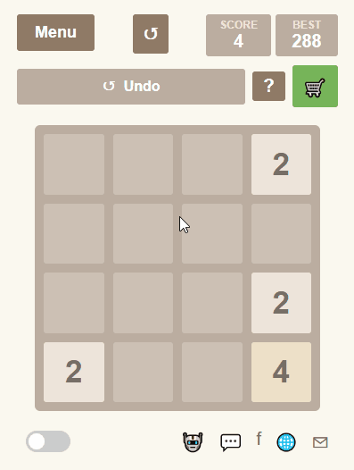

# 2048: Recreated in YOLO Mode



> I rebuilt a 400k+ user game using Gemini CLI in YOLO mode. This is the story of what actually happened.

This project is an experiment with full vibe coding. The goal was to take the famous 2048 puzzle game and recreate it from scratch as a Google Chrome Extension, not for production, but to see how fast "vibe coding" with YOLO mode could go. The entire process was driven by autonomous gemini cli, starting with a single screenshot and a simple prompt.

## Features

Even as an experiment, the result is a fully functional and classic 2048 experience:

- **Classic 2048 Gameplay:** A 4x4 grid where you slide and merge tiles.
- **Score & Persistent Best Score:** Your high score is saved locally using the `chrome.storage` API, so you can always chase a new record.
- **Undo Your Last Move:** Made a mistake? Hit the undo button to go back one step.
- **Sleek, Minimalist UI:** A clean, modern take on the classic 2048 design.
- **Keyboard Controls:** Use Arrow Keys or WASD for fluid gameplay.
- **Game Over & Restart:** A clear "Game Over" screen with a "Try Again" button.

## The "YOLO Mode" Philosophy

This wasn't a typical development cycle. It was an exercise in trust and effective prompting, following a few key steps:

1.  **Start YOLO Mode:** Give the AI agent permission to do whatever it takes to get the work done.
2.  **Visual Prompting:** The initial prompt was just a screenshot of the original game, allowing the AI to "see" the desired outcome.
3.  **Context Loop:** A simple prompt—"I want to turn this into a chrome ext..explain briefly"—opened a dialogue, allowing the AI to ask follow-up questions to ensure alignment.
4.  **Let it Cook:** With the context set, the final step was to let the coding agent complete the tasks.

The result is a testament to what's possible with modern AI tools and a bit of creative prompting.

**P.S.** If you decide to go with YOLO mode yourself, it is best practice to run it inside a sandbox.

## How to Install and Play

You can run this extension locally in just a few steps:

1.  **Clone the Repository:**
    ```bash
    git clone https://github.com/siddqamar/2048-chrome-ext-rebuilt.git
    ```
2.  **Open Chrome Extensions:**
    - Open Google Chrome, type `chrome://extensions` in the address bar, and press Enter.
3.  **Enable Developer Mode:**
    - In the top right corner of the extensions page, toggle the "Developer mode" switch to **On**.
4.  **Load Unpacked:**
    - A new menu will appear. Click the **"Load unpacked"** button.
5.  **Select the Folder:**
    - In the file dialog, navigate to the folder where you cloned the repository and select it.
6.  **Play!**
    - The "2048 Puzzle" extension will now appear in your extensions list. Click the puzzle icon in your Chrome toolbar to open the game popup and start playing!

## Tech Stack

- **Frontend:** Vanilla `HTML5`, `CSS3` (with Flexbox & Grid)
- **Logic:** Plain `JavaScript (ES6+)`
- **Platform:** `Chrome Extension API (Manifest V3)`

## Connect with Me

- **LinkedIn:** [[Siddiqui Qamar](https://www.linkedin.com/in/siddqamar/)]
- **X (Twitter):** [[@siddqamar_ai](https://x.com/siddqamar_ai)]
